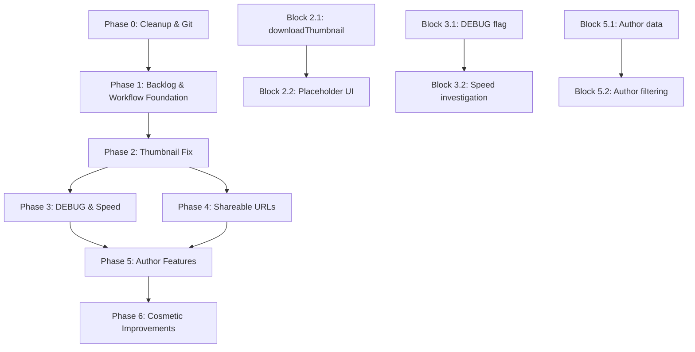

# Playful Moon Plan

## Goal
Establish a future backlog system for Telegram Gallery and implement the highest-priority items in an iterative loop:
1. Create structured backlog file with all proposed ideas organized by importance
2. Update agent rules to check backlog when looking for new tasks
3. Implement critical thumbnail efficiency fix (bandwidth waste)
4. Set up iterative execution process for backlog items

## Status: completed

## Current State
- Phase 0 cleanup completed (orphaned files deleted, legacy files untracked, .gitignore updated, kilo.jsonc committed, commits pushed)
- Phase 1 backlog & workflow foundation completed (backlog file created, agent rules updated, workflow improvements implemented)
- Phase 2 thumbnail efficiency fix completed (downloadThumbnail logic fixed, loadThumbnailBlob optimized, glyph fallback verified)
- Phase 3 DEBUG flag & speed investigation completed (environment variable added, logging in both adapters, buffer copy removed, progress throttled)
- Phase 4 shareable URLs completed (viewer route added, open/close syncs URL, copy link button, pending route handling)
- Phase 5 author features completed
- Phase 6 cosmetic improvements completed
- 34 commits ahead of `origin/main`, no modified files
- Thumbnail inefficiency confirmed: `downloadThumbnail` downloads full media when `getThumbnail('s')` returns null, and `loadThumbnailBlob` falls back to downloading full media
- Future backlog system operational with 8 items (all completed)
- Multiple feature ideas proposed by user but not tracked

## Progress
| Phase | Status | Notes |
|-------|--------|-------|
| Phase 0 | ✅ Completed | Cleanup & Git housekeeping |
| Phase 1 | ✅ Completed | Backlog & workflow foundation |
| Phase 2 | ✅ Completed | Thumbnail efficiency fix |
| Phase 3 | ✅ Completed | DEBUG flag & speed investigation |
| Phase 4 | ✅ Completed | Shareable URLs |
| Phase 5 | ✅ Completed | Author features |
| Phase 6 | ✅ Completed | Cosmetic improvements |

## Phase 0: Cleanup & Git Housekeeping (1 block) [COMPLETED]
**Block 0.1: Clean up and commit**
1. Delete orphaned files/directories:
   - `debug-auth.png`
   - `dist/` (build output)
   - `playwright-report/` (test reports)
   - `test-results/` (test artifacts)
   - `tsconfig.tsbuildinfo` (TypeScript build info)
2. Remove legacy tracked files from git (keep in working tree):
   - `git rm --cached main.js style.css`
3. Update `.gitignore` with recommended Playwright outputs:
   - Add `playwright-report/`, `test-results/`, `debug-*.png`
4. Commit `kilo.jsonc` changes:
   - Run `npm run check` (type check)
   - Update `STATUS.md` with cleanup block
   - Commit with message `chore: cleanup orphaned files, update gitignore, simplify kilo config`
5. Push commits to remote:
   - `git push origin main`

## Backlog Items (Organized by Importance)

### P0 - Critical / Blocking Issues
| ID | Title | Description | Priority | Complexity | Dependencies | Status |
|----|-------|-------------|----------|------------|--------------|--------|
| FB001 | Fix thumbnail download inefficiency | Thumbnails download full-size media when `getThumbnail('s')` returns null, wasting bandwidth and slowing loading | P0 | M | None | completed |
| FB008 | Investigate download speed regression | Check if recent changes affected Telegram API download performance; compare with earlier git versions | P0 | M | None | completed |

### P1 - High Priority Improvements  
| ID | Title | Description | Priority | Complexity | Dependencies | Status |
|----|-------|-------------|----------|------------|--------------|--------|
| FB002 | DEBUG flag for development | Add environment flag (`VITE_DEBUG_MEDIA_SIZES`) to log available thumbnail/image sizes | P1 | S | None | completed |
| FB004 | Shareable media URLs | Opened media in preview should appear in URL (`#/gallery/:dialogId/view/:messageId`) for direct sharing | P1 | M | None | completed |

### P2 - Medium Priority Features
| ID | Title | Description | Priority | Complexity | Dependencies | Status |
|----|-------|-------------|----------|------------|--------------|--------|
| FB003 | Author-based filtering | Filter gallery by message authors with checklist of all known participants | P2 | M | FB005 (author data) | completed |
| FB005 | Improved media overlay | Show author name instead of meaningless Telegram auto-filenames; keep filenames for uploaded documents | P2 | S | None | completed |

### P3 - Low Priority / Cosmetic
| ID | Title | Description | Priority | Complexity | Dependencies | Status |
|----|-------|-------------|----------|------------|--------------|--------|
| FB006 | Preview UI cosmetics | Remove opacity, make preview cover background completely (100%) | P3 | S | None | completed |
| FB007 | Thumbnail refresh callback | Rerender thumbnails after media downloads complete | P3 | S | FB001 | completed |

## Implementation Strategy

### Phase 0: Cleanup & Git Housekeeping (1 block) [COMPLETED]
**Block 0.1: Clean up and commit**
1. Delete orphaned files/directories:
   - `debug-auth.png`
   - `dist/` (build output)
   - `playwright-report/` (test reports)
   - `test-results/` (test artifacts)
   - `tsconfig.tsbuildinfo` (TypeScript build info)
2. Remove legacy tracked files from git (keep in working tree):
   - `git rm --cached main.js style.css`
3. Update `.gitignore` with recommended Playwright outputs:
   - Add `playwright-report/`, `test-results/`, `debug-*.png`
4. Update `STATUS.md` to register new plan (`.kilo/plans/1776334107170-playful-moon.md`) as active and reflect current commit count
5. Commit `kilo.jsonc` changes and `STATUS.md` updates:
   - Run `npm run check` (type check)
   - Update `STATUS.md` with cleanup block and plan registration
   - Commit with message `chore: cleanup orphaned files, update gitignore, simplify kilo config; activate backlog plan`
6. Push commits to remote:
   - `git push origin main`

### Phase 1: Backlog & Workflow Foundation (2 blocks)
**Block 1.1: Create backlog system**
1. Create `.kilo/future-backlog.md` with the above structured content
2. Update `.kilo/agent/hard-route.md`:
   - Replace the stale reference to `.kilo/status.md` with `STATUS.md`
   - Add rule to check backlog when:
     - No active plan exists in `STATUS.md`
     - Current plan completed with no immediate blockers
     - User requests new feature work without specifics
3. Commit foundation changes with `git add .kilo/future-backlog.md .kilo/agent/hard-route.md`

**Block 1.2: Implement workflow improvements**
1. **STATUS.md template enhancements**:
   - Add "Completed Plans" section after "Active Plan" with table of completed plans (plan file, goal, completion date).
   - Update "Current Todo States" to group tasks by phase/plan (e.g., "Phase 0:", "Phase 1:").
   - Ensure "Current Phase" field reflects the active phase (e.g., "Phase 1: Backlog & Workflow Foundation").
   - Add "Next Execution Order" placeholder that will be updated after each phase.
2. **Phase-transition rule**:
   - Add explicit rule to `AGENTS.md`: after completing a phase, update `STATUS.md` "Current Phase" and "Next Execution Order" before moving to next phase.
3. **Plan-file status marker**:
   - Add standard status line `## Status: draft/active/completed` to plan template (existing plans can be updated retroactively).
4. **Port-conflict prevention**:
   - Add pre‑validation step to test commands: kill any process on port 5173 before starting dev server (`lsof -ti:5173 | xargs kill -9 2>/dev/null || true`).
   - Update `AGENTS.md` "Dev server must always use port 5173" rule with this kill step.
5. **Backlog edit policy**:
   - Add rule to `AGENTS.md`: backlog file (`.kilo/future-backlog.md`) may only be edited during plan creation (Plan mode); never modify it during code implementation (Code workflow).
   - Update `.kilo/agent/hard-route.md` to reflect that backlog checking is part of planning process, not code execution.
6. **Commit workflow improvements**:
   - Update `STATUS.md` with new template sections.
   - Update `AGENTS.md` with phase‑transition rule, port‑conflict prevention, and backlog edit policy.
   - Commit changes with message `chore: improve workflow with completed‑plans section, phase‑grouped todos, port‑conflict prevention, backlog edit policy`.

### Phase 2: Critical Fix - Thumbnail Efficiency (FB001) (2 blocks)
**Block 2.1: Fix `downloadThumbnail` logic**
1. **Modify `mtcute.ts` `downloadThumbnail`:**
   - Define array of sizes: `['s', 'm', 'x']`
   - Loop through sizes, call `stored.getThumbnail(size)`
   - If thumbnail found, download via `client.downloadAsBuffer(thumb)` and return
   - If loop ends with no thumbnail, return `null`
   - Remove the fallback to `client.downloadAsBuffer(stored)` for photos

2. **Update `thumbnails.ts` `loadThumbnailBlob`:**
   - After `cachedThumb` null check, add:
     ```ts
     const cachedFull = await getCachedBlob(item, 'full')
     if (cachedFull) {
       const generatedThumb = isImageItem(item)
         ? await createImageThumbnail(cachedFull)
         : await createVideoThumbnail(cachedFull)
       if (generatedThumb) return generatedThumb
     }
     return null
     ```
   - Remove the call to `getCachedOrDownloadBlob(item, 'full')` (line 91)

3. **Update mock adapter (`mock.ts`) to simulate missing thumbnails for some sample items:**
   - Ensure some media items in `samples/dialogs.json` have no thumbnail entries
   - Or modify `MockTelegramAdapter.downloadThumbnail` to return `null` for certain IDs

4. **Test:**
   - Run `npm run check`
   - Run short test suite to verify no regressions
   - Manually inspect mock gallery: some items should show glyphs instead of thumbnails

5. **Update `STATUS.md` todo states:** Mark Task 13 (Phase 2 Block 2.1) as completed after validation passes.

**Block 2.2: Improve placeholder UI**
1. **Verify `hasThumbnail` accuracy:** Ensure `hasThumbnail` returns `false` for media types that never have thumbnails (audio, text, other, large-file). No changes needed for photos/videos.
2. **Ensure glyph fallback works:** Check that `MediaItem.svelte` and `MediaListRow.svelte` display glyphs when `thumbUrl` remains `null` (i.e., when `loadThumbnailBlob` returns `null`). If needed, adjust CSS to ensure glyph is visible.
3. **Update mock data:** If mock adapter simulates missing thumbnails, verify that glyphs appear for those items in the gallery.
4. **Run validation:** Run `npm run check` and short test suite to confirm UI works.
5. **Update `STATUS.md`:** Mark Task 14 (Phase 2 Block 2.2) as completed after validation passes.

### Phase 3: DEBUG Flag (FB002) & Speed Investigation (FB008) (2 blocks)
**Block 3.1: Implement DEBUG logging**
- Add `VITE_DEBUG_MEDIA_SIZES` environment variable to `.env.example` (default `false`)
- Update `src/lib/debug.ts`:
  - Add `DEBUG_MEDIA_SIZES = import.meta.env.VITE_DEBUG_MEDIA_SIZES === 'true'`
  - Export constant for use elsewhere
- Modify `src/lib/telegram/mtcute.ts` `downloadThumbnail()`:
  - When `DEBUG_MEDIA_SIZES` is true, log with `debugLog`:
    - Media ID, kind, dimensions
    - For each size `'s'`, `'m'`, `'x'`: whether `getThumbnail(size)` returns a thumbnail (log dimensions if present)
    - Which thumbnail was selected (or none)
- Also log in `downloadFull()` if needed (optional)
- Test debug output in mock mode by setting `VITE_DEBUG_MEDIA_SIZES=true` and observing console

**Block 3.2: Investigate download speed**
- Use `git log --oneline -p src/lib/telegram/mtcute.ts` to compare `downloadFull()` implementation with earlier commits (especially before Phase 3 changes)
- Look for:
  - Added progress callback overhead (callbacks per chunk vs per percent)
  - Buffer copying (`cloneBufferToBlob` in `files.ts`) – ensure it's not duplicated
  - Concurrent download limits: check if adapter uses any limiting (maybe `client.downloadAsBuffer` options)
- If possible, add simple performance measurement in `downloadFull()`:
  - Log timing with `debugLog` when `DEBUG_MEDIA_SIZES` enabled
  - Measure time from start to finish, chunk count
- Compare with mock adapter download speed (should be instant)
- Document findings in `STATUS.md` and propose optimizations if needed (e.g., throttle progress callbacks, remove unnecessary buffering)

### Phase 4: Shareable URLs (FB004) (1 block)
**Block 4.1: URL-based media sharing**
- Extend router in `src/lib/routing.ts`:
  - Add new route type `{ type: 'viewer', dialogId: string, messageId: number }`
  - Update `parseHash` to handle `/gallery/:dialogId/view/:messageId`
  - Update `navigate`, `getUrl`, `isRoute` accordingly
- Update `src/components/gallery/ViewerWrapper.svelte`:
  - When opening media, push viewer route via router (`navigateToViewer(dialogId, messageId)`)
  - When closing viewer, navigate back to gallery route (or previous route)
  - On mount, check current route; if route is viewer, open the specified media automatically
- Add "Copy link" button to viewer toolbar:
  - Use `router.getUrl(viewerRoute)` to generate full URL (including origin)
  - Copy to clipboard with toast feedback
- Basic scroll position preservation (low priority enhancement):
  - Store scroll position when leaving gallery, restore when returning

### Phase 5: Author Features (FB003, FB005) (2 blocks)
**Block 5.1: Extract and display author data**
- Author data is already present in `MediaItem.sender` (populated by `mtcute.ts` `messageToProject`)
- Update `src/components/gallery/MediaItem.svelte` and `src/components/gallery/MediaListRow.svelte`:
  - Show author badge (`{item.sender}`) near the media overlay (similar to existing duration badge)
  - Style with subtle background, small font
- Implement filename analysis in `src/lib/media.ts`:
  - Add `isTelegramAutoFilename(fileName: string): boolean` detecting patterns:
    - `photo_YYYY-MM-DD_HH-MM-SS.*`
    - `VID_YYYYMMDD_HHMMSS.*`
    - `audio_YYYYMMDD_HHMMSS.*`
    - `document_YYYYMMDD_HHMMSS.*`
  - Add `displayNameForMedia(item: MediaItem): string`:
    - If `isTelegramAutoFilename(item.filename)` and `item.sender` exists: return `item.sender`
    - Else: return `item.filename` (meaningful uploaded filename)
- Update overlay in `MediaItem` and `MediaListRow` to use `displayNameForMedia` for the filename line

**Block 5.2: Author filtering UI**
- Extract unique author list from gallery store (`src/stores/gallery.ts`):
  - Create derived store `authors` that returns `string[]` of distinct `sender` values from `mediaItems` (excluding `null`/`undefined`)
  - Sort alphabetically
- Add author filter component (`src/components/gallery/AuthorFilter.svelte`):
  - Similar to `MediaTypeFilter` (pills style)
  - Allow multiple selection (checklist)
  - Store selected authors in gallery store (`selectedAuthors: string[]`)
- Update `src/stores/gallery.ts`:
  - Add `selectedAuthors` writable store (initial empty)
  - Add `filteredMediaItems` derived store that respects both `selectedFilter` and `selectedAuthors`
  - Update `matchesFilter` helper to also check author match
- Update `GalleryGrid` and `MediaListRow` to use filtered items
- Ensure filter UI appears in gallery header (next to media type filter)

### Phase 6: Cosmetic Improvements (FB006, FB007) (1 block)
**Block 6.1: UI refinements**
- Update `ViewerWrapper.svelte` CSS: remove opacity, set `background: rgba(0,0,0,1)`
- Implement thumbnail refresh callback system
- Add event/callback when `downloadFull` completes
- Trigger `loadThumbnailBlob` refresh for affected items

## Execution Order & Dependencies


## Validation Requirements
Each block must pass:
- Pre‑validation: ensure port 5173 is free (`lsof -ti:5173 | xargs kill -9 2>/dev/null || true`)
- `npm run check` (type checking)
- `npm run test:short` (baseline functionality)
- Relevant `npm run test:long` tests for affected features
- Manual verification for UI changes

## Files To Be Touched
1. `kilo.jsonc` (modified, agent config removed)
2. `.gitignore` (updated with Playwright outputs)
3. `.kilo/future-backlog.md` (new)
4. `.kilo/agent/hard-route.md` (modified)
5. `AGENTS.md` (updated with phase‑transition rule and port‑conflict prevention)
6. `src/lib/telegram/mtcute.ts`
7. `src/lib/thumbnails.ts`
8. `src/lib/media.ts`
9. `src/lib/debug.ts`
10. `.env.example`
11. `src/lib/routing.ts`
12. `src/lib/telegram/mock.ts` (optional, for simulating missing thumbnails)
13. `src/components/gallery/ViewerWrapper.svelte`
14. `src/components/gallery/MediaItem.svelte`
15. `src/components/gallery/MediaListRow.svelte`
16. `src/components/gallery/AuthorFilter.svelte` (new)
17. `src/stores/gallery.ts`
18. `STATUS.md` (for each block completion)
19. `APPLICATION_SPEC.md` (if behavior changes)

**Files to be deleted:** `debug-auth.png`, `dist/`, `playwright-report/`, `test-results/`, `tsconfig.tsbuildinfo`
**Legacy tracked files to be removed from git:** `main.js`, `style.css`

## Success Criteria
1. Backlog system operational with 8 tracked items
2. Workflow improvements implemented (completed‑plans section, phase‑grouped todos, port‑conflict prevention)
3. Thumbnail downloads no longer waste bandwidth (download full media)
4. DEBUG flag provides useful media size logging
5. Shareable URLs work for direct media access
6. Author filtering and overlay improvements implemented
7. Preview UI covers background completely
8. All tests pass, no regressions

## Notes & Considerations
- **Thumbnail fix impact**: Some media may show placeholders instead of thumbnails (correct behavior)
- **DEBUG flag**: Should be disabled in production by default
- **Author filtering**: Requires message author data which may not be available in mock mode
- **Speed investigation**: May require real Telegram API testing to confirm findings
- **Iterative approach**: Each phase produces usable improvements; can pause/resume
- **Backlog item status**: When a new plan is created to address a backlog item, update its status in `.kilo/future-backlog.md` (e.g., from "proposed" to "planned" or "in progress") as part of plan creation (Plan mode). Status updates are only allowed during plan creation, not during code implementation.

## Cross-References
- Current `STATUS.md`: Phase 3 complete, no active backlog
- `APPLICATION_SPEC.md`: Current supported behavior
- `AGENTS.md`: Workflow rules
- Existing plans: `.kilo/plans/1776323125899-stellar-panda.md` (completed)

## Ready for Implementation?
This plan establishes the backlog system and defines the first critical fix. Once approved, execution can begin with Phase 0 (cleanup & git housekeeping), followed by Phase 1 (backlog foundation), then iterative implementation of backlog items in priority order.