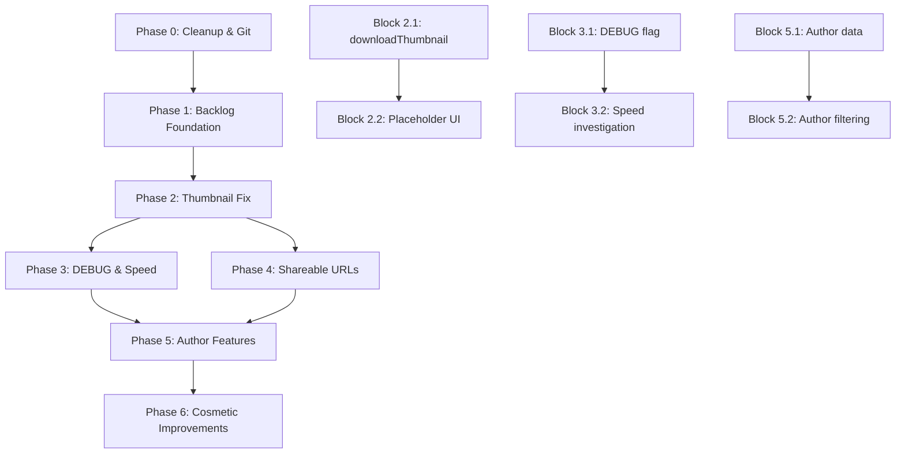

# Playful Moon Plan

## Goal
Establish a future backlog system for Telegram Gallery and implement the highest-priority items in an iterative loop:
1. Create structured backlog file with all proposed ideas organized by importance
2. Update agent rules to check backlog when looking for new tasks
3. Implement critical thumbnail efficiency fix (bandwidth waste)
4. Set up iterative execution process for backlog items

## Current State
- Phase 3 complete, no active backlog blocks in `STATUS.md`
- 68 commits ahead of `origin/main`, 1 modified file (`kilo.jsonc`)
- Thumbnail inefficiency identified: full media downloads when Telegram doesn't provide small thumbnails
- No future backlog system exists
- Multiple feature ideas proposed by user but not tracked
- Orphaned files/directories present: `debug-auth.png`, `dist/`, `playwright-report/`, `test-results/`, `tsconfig.tsbuildinfo`
- Legacy tracked files: `main.js`, `style.css` (old MVP files)
- `.gitignore` missing Playwright output entries

## Phase 0: Cleanup & Git Housekeeping (1 block)
**Block 0.1: Clean up and commit**
1. Delete orphaned files/directories:
   - `debug-auth.png`
   - `dist/` (build output)
   - `playwright-report/` (test reports)
   - `test-results/` (test artifacts)
   - `tsconfig.tsbuildinfo` (TypeScript build info)
2. Remove legacy tracked files from git (keep in working tree):
   - `git rm --cached main.js style.css`
3. Update `.gitignore` with recommended Playwright outputs:
   - Add `playwright-report/`, `test-results/`, `debug-*.png`
4. Commit `kilo.jsonc` changes:
   - Run `npm run check` (type check)
   - Update `STATUS.md` with cleanup block
   - Commit with message `chore: cleanup orphaned files, update gitignore, simplify kilo config`
5. Push commits to remote:
   - `git push origin main`

## Backlog Items (Organized by Importance)

### P0 - Critical / Blocking Issues
| ID | Title | Description | Priority | Complexity | Dependencies | Status |
|----|-------|-------------|----------|------------|--------------|--------|
| FB001 | Fix thumbnail download inefficiency | Thumbnails download full-size media when `getThumbnail('s')` returns null, wasting bandwidth and slowing loading | P0 | M | None | proposed |
| FB008 | Investigate download speed regression | Check if recent changes affected Telegram API download performance; compare with earlier git versions | P0 | M | None | proposed |

### P1 - High Priority Improvements  
| ID | Title | Description | Priority | Complexity | Dependencies | Status |
|----|-------|-------------|----------|------------|--------------|--------|
| FB002 | DEBUG flag for development | Add environment flag (`VITE_DEBUG_MEDIA_SIZES`) to log available thumbnail/image sizes | P1 | S | None | proposed |
| FB004 | Shareable media URLs | Opened media in preview should appear in URL (`#/gallery/:dialogId/view/:messageId`) for direct sharing | P1 | M | None | proposed |

### P2 - Medium Priority Features
| ID | Title | Description | Priority | Complexity | Dependencies | Status |
|----|-------|-------------|----------|------------|--------------|--------|
| FB003 | Author-based filtering | Filter gallery by message authors with checklist of all known participants | P2 | M | FB005 (author data) | proposed |
| FB005 | Improved media overlay | Show author name instead of meaningless Telegram auto-filenames; keep filenames for uploaded documents | P2 | S | None | proposed |

### P3 - Low Priority / Cosmetic
| ID | Title | Description | Priority | Complexity | Dependencies | Status |
|----|-------|-------------|----------|------------|--------------|--------|
| FB006 | Preview UI cosmetics | Remove opacity, make preview cover background completely (100%) | P3 | S | None | proposed |
| FB007 | Thumbnail refresh callback | Rerender thumbnails after media downloads complete | P3 | S | FB001 | proposed |

## Implementation Strategy

### Phase 0: Cleanup & Git Housekeeping (1 block)
**Block 0.1: Clean up and commit**
1. Delete orphaned files/directories:
   - `debug-auth.png`
   - `dist/` (build output)
   - `playwright-report/` (test reports)
   - `test-results/` (test artifacts)
   - `tsconfig.tsbuildinfo` (TypeScript build info)
2. Remove legacy tracked files from git (keep in working tree):
   - `git rm --cached main.js style.css`
3. Update `.gitignore` with recommended Playwright outputs:
   - Add `playwright-report/`, `test-results/`, `debug-*.png`
4. Update `STATUS.md` to register new plan (`.kilo/plans/1776334107170-playful-moon.md`) as active and reflect current commit count
5. Commit `kilo.jsonc` changes and `STATUS.md` updates:
   - Run `npm run check` (type check)
   - Update `STATUS.md` with cleanup block and plan registration
   - Commit with message `chore: cleanup orphaned files, update gitignore, simplify kilo config; activate backlog plan`
6. Push commits to remote:
   - `git push origin main`

### Phase 1: Backlog Foundation (1 block)
**Block 1.1: Create backlog system**
1. Create `.kilo/future-backlog.md` with the above structured content
2. Update `.kilo/agent/hard-route.md` to check backlog when:
   - No active plan exists in `STATUS.md`
   - Current plan completed with no immediate blockers
   - User requests new feature work without specifics
3. Commit foundation changes with `git add .kilo/future-backlog.md .kilo/agent/hard-route.md`

### Phase 2: Critical Fix - Thumbnail Efficiency (FB001) (2 blocks)
**Block 2.1: Fix `downloadThumbnail` logic**
- Modify `src/lib/telegram/mtcute.ts`:
  - Try multiple thumbnail sizes (`'s'`, `'m'`, `'x'`) before falling back
  - Never download full media for thumbnails
  - Return `null` if no thumbnail available
- Update `src/lib/thumbnails.ts` `loadThumbnailBlob()`:
  - Return `null` instead of downloading full media when thumbnail unavailable
  - Remove fallback to full media download
- Test with mock adapter to ensure placeholder behavior

**Block 2.2: Improve placeholder UI**
- Update `hasThumbnail()` in `src/lib/media.ts` for accuracy
- Ensure `MediaItem.svelte` and `MediaListRow.svelte` show appropriate glyphs
- Verify all tests pass (short/long suites)

### Phase 3: DEBUG Flag (FB002) & Speed Investigation (FB008) (2 blocks)
**Block 3.1: Implement DEBUG logging**
- Add `VITE_DEBUG_MEDIA_SIZES` env variable to `.env.example`
- Update `src/lib/debug.ts` with `DEBUG_MEDIA_SIZES` constant
- Modify `src/lib/telegram/mtcute.ts` `downloadThumbnail()`:
  - Log available thumbnail sizes when flag enabled
  - Log media metadata for debugging
- Test debug output in mock mode

**Block 3.2: Investigate download speed**
- Compare current `downloadFull()` in `mtcute.ts` with previous git versions
- Check for unintended buffering, progress callback overhead
- Verify concurrent download limits aren't too restrictive
- Document findings and propose optimizations if needed

### Phase 4: Shareable URLs (FB004) (1 block)
**Block 4.1: URL-based media sharing**
- Update viewer routing in `src/components/gallery/ViewerWrapper.svelte`
- Push history state: `#/gallery/:dialogId/view/:messageId`
- Handle route on app load to auto-open specified media
- Add "Copy link" button to viewer toolbar
- Basic scroll position preservation (low priority enhancement)

### Phase 5: Author Features (FB003, FB005) (2 blocks)
**Block 5.1: Extract and display author data**
- Modify message processing to extract author information
- Update `MediaItem` and `MediaListRow` to show author badge
- Implement filename analysis: detect Telegram auto-patterns vs meaningful names
- Show author name for Telegram media, filename for documents

**Block 5.2: Author filtering UI**
- Extract unique author list from gallery store
- Add author filter component similar to media type filter
- Store filter state in gallery store
- Update gallery grid/list to respect author filter

### Phase 6: Cosmetic Improvements (FB006, FB007) (1 block)
**Block 6.1: UI refinements**
- Update `ViewerWrapper.svelte` CSS: remove opacity, set `background: rgba(0,0,0,1)`
- Implement thumbnail refresh callback system
- Add event/callback when `downloadFull` completes
- Trigger `loadThumbnailBlob` refresh for affected items

## Execution Order & Dependencies

## Validation Requirements
Each block must pass:
- `npm run check` (type checking)
- `npm run test:short` (baseline functionality)
- Relevant `npm run test:long` tests for affected features
- Manual verification for UI changes

## Files To Be Touched
1. `kilo.jsonc` (modified, agent config removed)
2. `.gitignore` (updated with Playwright outputs)
3. `.kilo/future-backlog.md` (new)
4. `.kilo/agent/hard-route.md` (modified)
5. `src/lib/telegram/mtcute.ts`
6. `src/lib/thumbnails.ts`
7. `src/lib/media.ts`
8. `src/lib/debug.ts`
9. `.env.example`
10. `src/components/gallery/ViewerWrapper.svelte`
11. `src/components/gallery/MediaItem.svelte`
12. `src/components/gallery/MediaListRow.svelte`
13. `src/stores/gallery.ts`
14. `STATUS.md` (for each block completion)
15. `APPLICATION_SPEC.md` (if behavior changes)

**Files to be deleted:** `debug-auth.png`, `dist/`, `playwright-report/`, `test-results/`, `tsconfig.tsbuildinfo`
**Legacy tracked files to be removed from git:** `main.js`, `style.css`

## Success Criteria
1. Backlog system operational with 8 tracked items
2. Thumbnail downloads no longer waste bandwidth (download full media)
3. DEBUG flag provides useful media size logging
4. Shareable URLs work for direct media access
5. Author filtering and overlay improvements implemented
6. Preview UI covers background completely
7. All tests pass, no regressions

## Notes & Considerations
- **Thumbnail fix impact**: Some media may show placeholders instead of thumbnails (correct behavior)
- **DEBUG flag**: Should be disabled in production by default
- **Author filtering**: Requires message author data which may not be available in mock mode
- **Speed investigation**: May require real Telegram API testing to confirm findings
- **Iterative approach**: Each phase produces usable improvements; can pause/resume

## Cross-References
- Current `STATUS.md`: Phase 3 complete, no active backlog
- `APPLICATION_SPEC.md`: Current supported behavior
- `AGENTS.md`: Workflow rules
- Existing plans: `.kilo/plans/1776323125899-stellar-panda.md` (completed)

## Ready for Implementation?
This plan establishes the backlog system and defines the first critical fix. Once approved, execution can begin with Phase 0 (cleanup & git housekeeping), followed by Phase 1 (backlog foundation), then iterative implementation of backlog items in priority order.